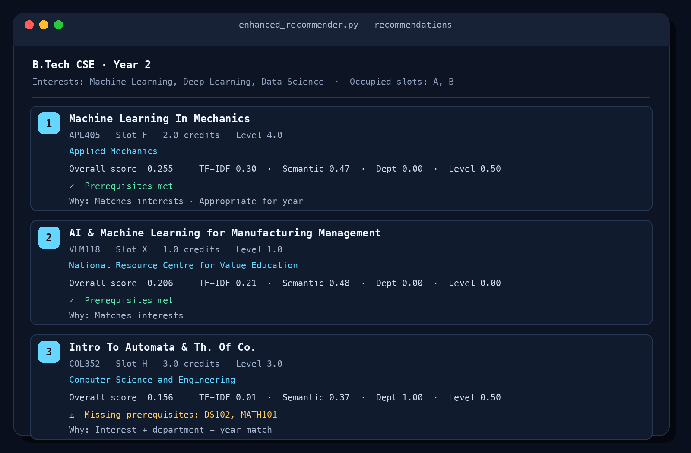
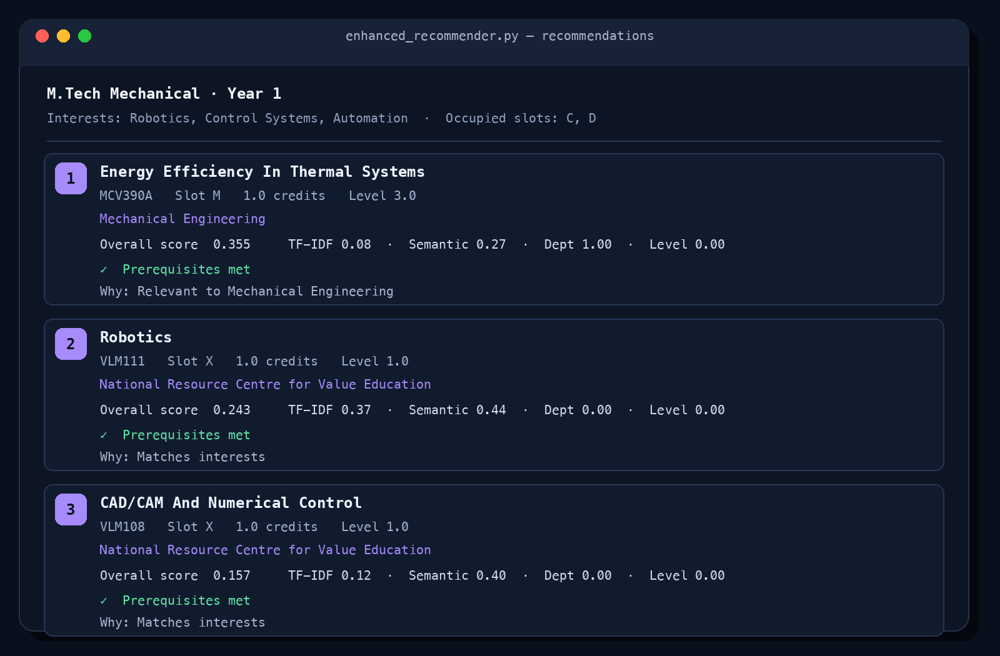
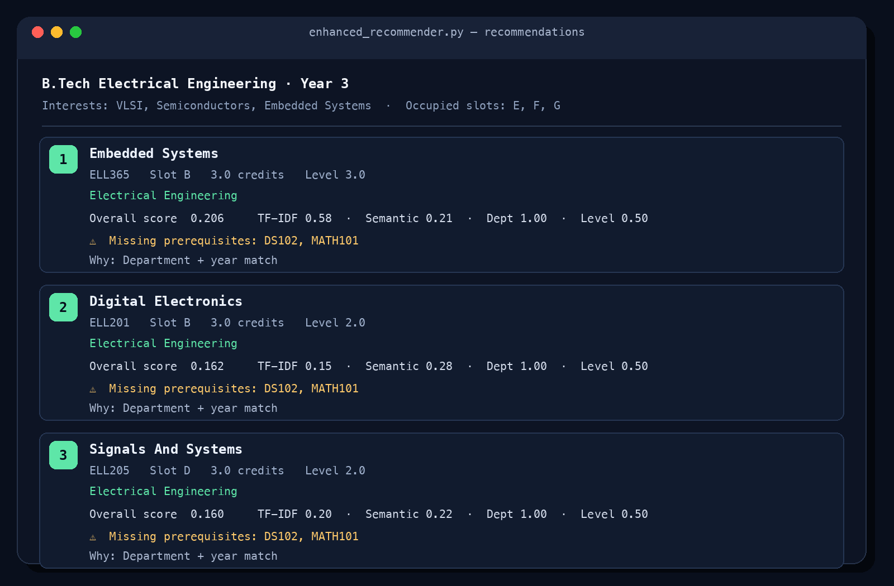
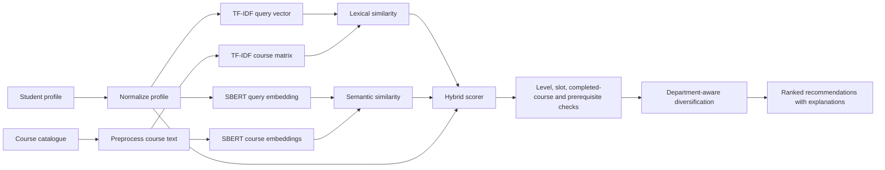

<div align="center">

# IIT Delhi Course Recommendation System

**A hybrid, explainable course recommender that combines lexical relevance, semantic similarity, academic context, and student constraints.**

[](https://www.python.org/)
[](https://scikit-learn.org/)
[](https://www.sbert.net/)
[](https://github.com/sumik1999/ml_recommender)

[Overview](#overview) · [Examples](#generated-recommendations) · [Quick start](#quick-start) · [How it works](#how-it-works) · [Project structure](#project-structure)

</div>

---

## Overview

This project recommends IIT Delhi courses from a student profile containing interests, career goals, competencies, department, year of study, completed courses, occupied timetable slots, and credit requirements.

Unlike a pure keyword search, the enhanced recommender uses a **hybrid ranking pipeline**:

- **TF-IDF similarity** for direct keyword and phrase overlap;
- **SBERT embeddings** for semantic relevance;
- **department and level signals** for academic fit;
- **prerequisite, timetable, and completed-course checks**;
- **department-aware diversification** to avoid repetitive results; and
- **human-readable explanations** with a score breakdown for every recommendation.

### Dataset at a glance

| Resource | Records | Purpose |
|---|---:|---|
| `generated_course_dataset.csv` | 1,184 courses | Primary course catalogue used by the enhanced recommender |
| `iitd_students_200.csv` | 200 students | Synthetic student profiles for experimentation |
| `iitd_courses_100.csv` | 100 courses | Smaller synthetic course dataset |

> The included student and course data is synthetic/experimental. Recommendations are intended for research and demonstration, not official academic advising.

## Generated recommendations

The screenshots below were produced by running `enhanced_recommender.py` against the included 1,184-course dataset. Scores and prerequisite messages are shown exactly as generated by the recommendation pipeline.

### Machine learning profile



<details>
<summary><strong>View additional recommendation examples</strong></summary>

### Robotics and automation profile



### VLSI and embedded systems profile



</details>

## Key capabilities

| Capability | Description |
|---|---|
| Hybrid retrieval | Combines sparse TF-IDF and dense SBERT similarity |
| Academic context | Adds department and year-level relevance to ranking |
| Timetable awareness | Removes courses that conflict with occupied slots |
| Completed-course filtering | Prevents already completed courses from being recommended again |
| Prerequisite analysis | Extracts prerequisite codes and clearly flags missing courses |
| Diversity control | Limits repeated recommendations from the same department |
| Explainability | Reports ranking factors and plain-language reasons per course |
| Persistent caching | Reuses processed data, embeddings, and TF-IDF artifacts between runs |
| Resilient profile parsing | Accepts list, delimited-string, and JSON-like profile values |

## How it works



The current hybrid score is:

```text
score = 0.30 × TF-IDF similarity
      + 0.30 × SBERT similarity
      + 0.25 × department match
      + 0.05 × level appropriateness
      + 0.10 × competency alignment
```

Courses with unresolved prerequisites remain discoverable but receive a penalty and an explicit warning. Occupied-slot conflicts and previously completed courses are excluded before the final ranking.

## Quick start

### Prerequisites

- Python 3.10 or newer
- `pip`
- Internet access on the first run to download `all-MiniLM-L6-v2`
- Approximately 500 MB of free space for the model and generated caches

### 1. Clone the repository

```bash
git clone https://github.com/sumik1999/ml_recommender.git
cd ml_recommender
```

### 2. Create an isolated environment

```bash
python -m venv .venv
source .venv/bin/activate        # macOS/Linux
# .venv\Scripts\activate         # Windows PowerShell
```

### 3. Install dependencies

```bash
python -m pip install --upgrade pip
python -m pip install pandas numpy scikit-learn sentence-transformers torch
```

### 4. Run the demonstration

```bash
cd "Machine Learning project"
python enhanced_recommender.py
```

The demo generates recommendations for three profiles: CSE/ML, Mechanical/Robotics, and Electrical/VLSI. The first run may take longer while the embedding model and local cache files are created.

## Programmatic usage

Run the following from the `Machine Learning project` directory, or add that directory to `PYTHONPATH`:

```python
from enhanced_recommender import (
    EnhancedCourseRecommender,
    load_courses,
)

courses = load_courses()
recommender = EnhancedCourseRecommender(courses)

student = {
    "user_id": "U1001",
    "user_name": "Rahul",
    "user_program": "B.Tech",
    "user_department": "COL",
    "user_year_of_study": 2,
    "user_previous_courses": ["COL1000", "COL106", "COL216"],
    "user_course_interest": ["Machine Learning", "NLP"],
    "user_career_interest": "AI Research",
    "user_competencies": ["Python", "Mathematics"],
    "user_occupied_slots": ["A", "B"],
    "user_credits_requirement": 15.0,
}

recommendations = recommender.recommend(
    student,
    top_n=8,
    include_prereq_failures=True,
    diversity_factor=True,
)

print(recommender.format_recommendations(recommendations))
```

Each returned `Recommendation` contains course metadata, the overall score, individual scoring components, prerequisite status, and explanation strings.

## Profile schema

| Field | Type | Example | Description |
|---|---|---|---|
| `user_program` | string | `B.Tech` | Student's academic programme |
| `user_department` | string | `COL` | Department/course-prefix code |
| `user_year_of_study` | integer | `2` | Used for level-aware filtering |
| `user_previous_courses` | list/string | `["COL106"]` | Completed course codes |
| `user_course_interest` | list/string | `["NLP", "ML"]` | Topics the student wants to study |
| `user_career_interest` | string | `AI Research` | Intended career direction |
| `user_competencies` | list/string | `["Python"]` | Existing skills and knowledge |
| `user_occupied_slots` | list/string | `["A", "B"]` | Slots that must be excluded |
| `user_credits_requirement` | number | `15.0` | Remaining credit requirement |

## Project structure

```text
ml_recommender/
├── README.md
├── IMPROVEMENTS.md
├── assets/
│   └── screenshots/                  # Generated recommendation examples
├── generated_course_dataset.csv      # Primary 1,184-course dataset
├── iitd_courses_100.csv               # Compact synthetic course dataset
├── iitd_students_200.csv              # Synthetic student profiles
└── Machine Learning project/
    ├── enhanced_recommender.py         # Recommended implementation
    ├── optimised_cached_recommender.py # Cached baseline
    ├── optimised_recommender.py        # Optimized baseline
    ├── recommender_semantic.py         # Semantic baseline
    ├── recommender.py                  # Earlier recommender
    ├── mapping.json                    # Department mappings
    ├── pdf_course_parser.py            # Catalogue parsing utility
    └── generated_course_dataset.csv    # Runtime course data
```

Generated `.pkl` embeddings, local environments, PDFs, spreadsheets, and OS metadata are intentionally excluded through `.gitignore`.

## Design decisions

- **Warn instead of silently hiding:** courses with missing prerequisites may still be useful for future planning, so they are penalized and labelled rather than always removed.
- **Explain every result:** recommendation objects expose both component scores and readable reasons.
- **Prefer graceful degradation:** malformed or missing optional fields are normalized where possible.
- **Keep diversity configurable:** department-aware diversification can be disabled for narrowly focused searches.
- **Cache expensive work:** embeddings and vectorizers are persisted locally to improve subsequent startup times.

See [`IMPROVEMENTS.md`](IMPROVEMENTS.md) for the detailed evolution from the earlier implementations.

## Known limitations

- Course information and profiles are synthetic and may not reflect the current IIT Delhi catalogue.
- Prerequisites expressed only in free-form prose may not be extracted perfectly.
- Ranking quality has not yet been validated through a production user study.
- The repository currently provides a Python/CLI workflow rather than a deployed web interface.
- Generated recommendations should be verified against official programme rules and academic advice.

## Contributing

Contributions are welcome. For substantial changes, open an issue first to discuss the proposed dataset, ranking, evaluation, or interface changes. When submitting code, keep generated model caches and local environments out of version control.

## Acknowledgements

Built with [pandas](https://pandas.pydata.org/), [scikit-learn](https://scikit-learn.org/), [Sentence Transformers](https://www.sbert.net/), and the `all-MiniLM-L6-v2` sentence-embedding model.
